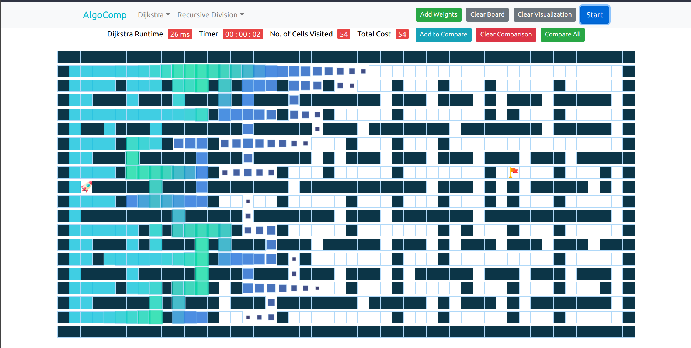
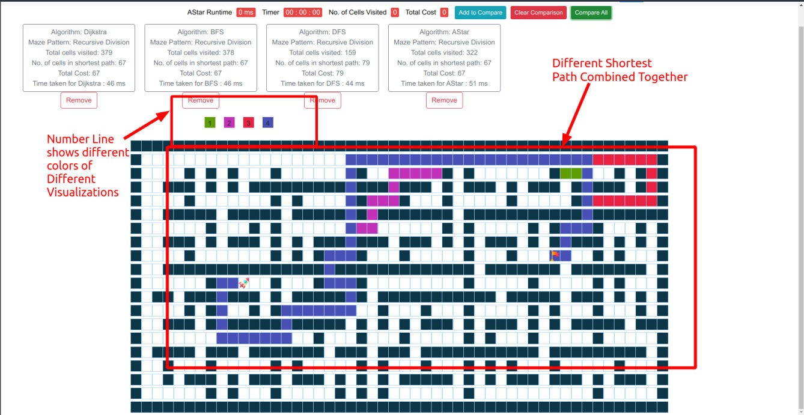

<h1 align="center">AlgoComp</h1>

<div align="center">


<br>

[](https://reactjs.org/ "React")
[](https://code.visualstudio.com/  "Visual Studio Code")

<h3>AlgoComp is React web application to visualize and compare search algorithms :detective:</h3>
</div>

---

<br>

## About
Learning or understanding the pathfinding or search algorithms and comparing them both theoretically and practically just by observing the examples or practicing its code becomes a complex task. It not only becomes confusing but also difficult to understand and as a result boring. Instead, visualizing it in real-time or with the help of animations we can make this complex process not only easy but also a comparatively simpler and a better approach for understanding. <b>This is the inspiration behind the development of this app.</b>

## Screenshots
<div align="center">
    
    
</div>

### Live at
https://jainam321.github.io/Visualization/

## Features of this Project!

* Graph of obstacles with option to select any node as Start and Finish node.
* Different path finding algorithms like Dijkshtra, BFS, DFS, A*.
* Different Maze algorithms to generate ready grid like Recursive Division, Horizontal & Vertical Division, etc.
* Comparison of all algorithms individually in terms of runtime of algorithm, cost of path, no. of nodes visited, visualization time.
* Comparison of all algorithms simultaneously in terms of final path of algorihtms by different colors.
* Handling of Edge Cases.


## Technology Stack

- React


## To Run the Project

```sh
$ git clone https://github.com/sourabhb77/AlgoComp-React-WebApp.git
$ cd AlgoComp-React-WebApp
$ npm start
Runs the app in the development mode.\
Open [http://localhost:3000](http://localhost:3000) to view it in the browser.
```


## Learn More

You can learn more in the [Create React App documentation](https://facebook.github.io/create-react-app/docs/getting-started).

To learn React, check out the [React documentation](https://reactjs.org/).


### Show some :heart: and star the repo to support the project